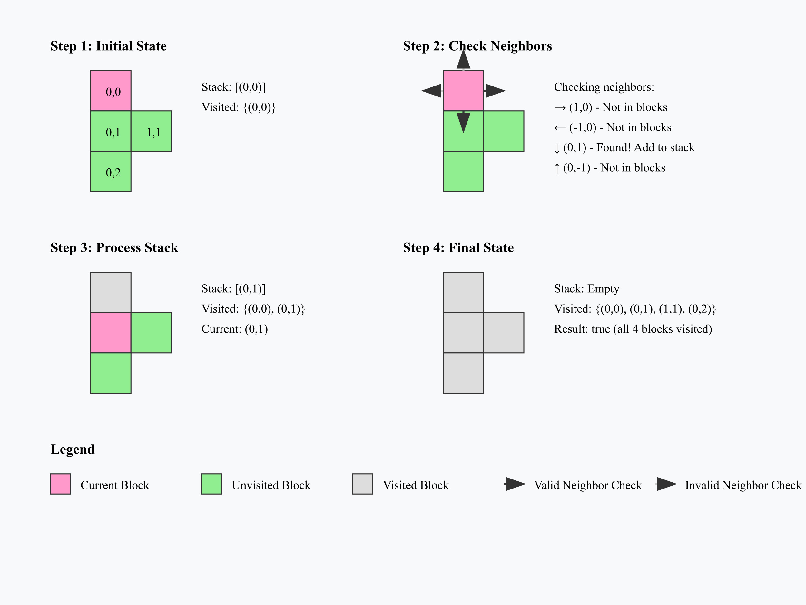
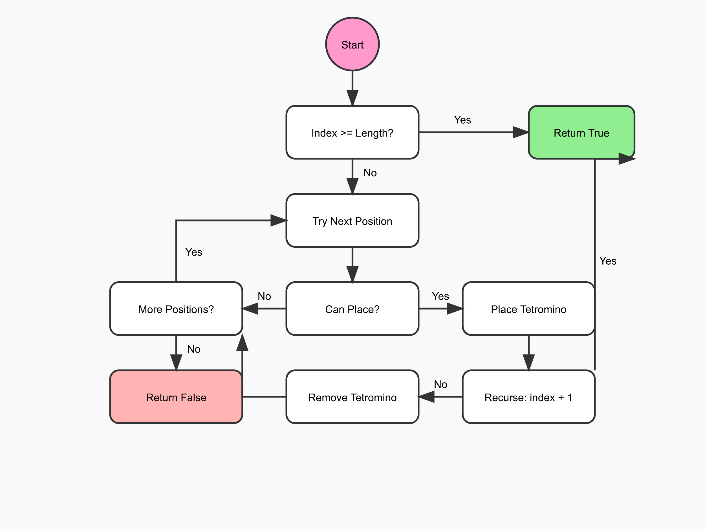

# Tetris-Optimizer

Develop a program that receives only one argument, a path to a text file which will contain a list of tetrominoes and assemble them in order to create the smallest square possible.


## Documentation

[Documentation](https://platform.zone01.gr/intra/athens/div-01/tetris-optimizer?event=200)


## Built with

* 
## Installation

1. Clone the repo

```bash
 git clone "repo URL"
```
    
2. Change directory

```bash
 cd tetris-optimizer
```

3. Git reset last version

```bash
 git reset --hard "specified-commit"
```
## Usage/Examples
Please visit [documentation](https://platform.zone01.gr/intra/athens/div-01/tetris-optimizer?event=200) in order to see all the examples.

1. Example of a text file:


```bash
#...
#...
#...
#...

....
....
..##
..##
```

If it isn't possible to form a complete square, the program should leave spaces between the tetrominoes. For example:

```bash
ABB.
ABB.
A...
A...
```
2. Example of a text file:

```bash
...#
...#
...#
...#

....
....
....
####

.###
...#
....
....

....
..##
.##.
....

....
.##.
.##.
....

....
....
##..
.##.

##..
.#..
.#..
....

....
###.
.#..
....
```
go run . sample.txt 
```bash
ABBBB.
ACCCEE
AFFCEE
A.FFGG
HHHDDG
.HDD.G

```


## Running Tests

The functions_test.go tests the "backbone" functions of the program in order to run as needed. Enter the functions directory and:

1. To run all the tests, run the following command:
```bash
  go test 
```
or you can:

2. test a specifi function using command:
```bash
  go test -run "FunctionName"
```


## Test cases

In order to find cases to test the program please visit this [link](https://github.com/01-edu/public/tree/master/subjects/tetris-optimizer/audit)
## Key Features 

DFS algorithm 

How the DFS algorithm works in a 2D array:

1. Starting Point:

The algorithm begins at a given cell (usually 0,0)
It marks this cell as visited


2. Exploration Process:

For each cell, it checks all four adjacent cells (up, right, down, left)
For each valid and unvisited adjacent cell, it recursively applies the same process
A cell is valid if it's within the grid boundaries


3. Implementation Details:

The Point struct represents a position in the grid
directions slice contains the four possible movements
visited array keeps track of explored cells
isValid function ensures we stay within grid boundaries


4. Key Features:

The algorithm uses recursion to explore deeply into one path before backtracking
It naturally forms a tree-like exploration pattern
Each cell is visited exactly once



Backtracking 

Key steps in the backtracking algorithm:

1. First, it checks if we've placed all tetrominoes (index >= len(tetrominoes))
If yes, we've found a solution and return true
If no, we try placing the current tetromino at each position on the board:

2. Check if we can place the tetromino at the current position
If yes, place it and recursively try to place the remaining pieces
If the recursive call succeeds, we've found a solution
If it fails, remove the tetromino and try the next position


3. If we've tried all positions and couldn't place the piece, return false



## Contact

- ychaniot (Ypatios Chaniotakos)

Project Link : "URL to repo"

